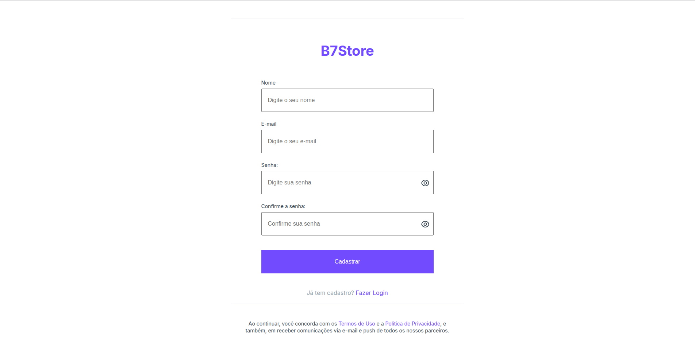
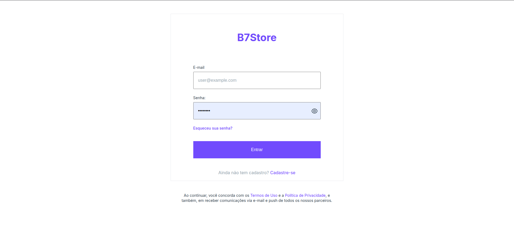
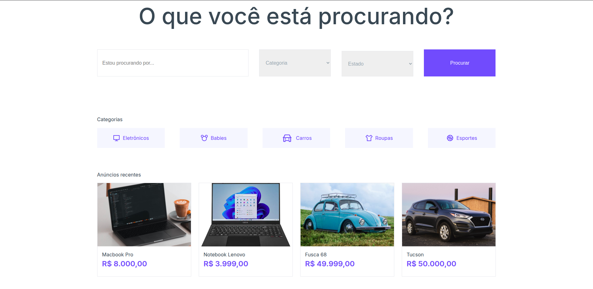
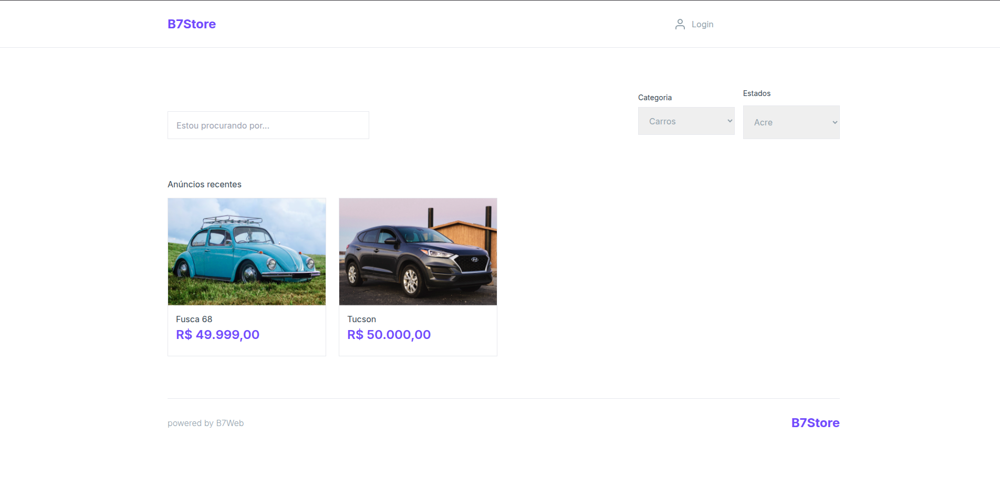
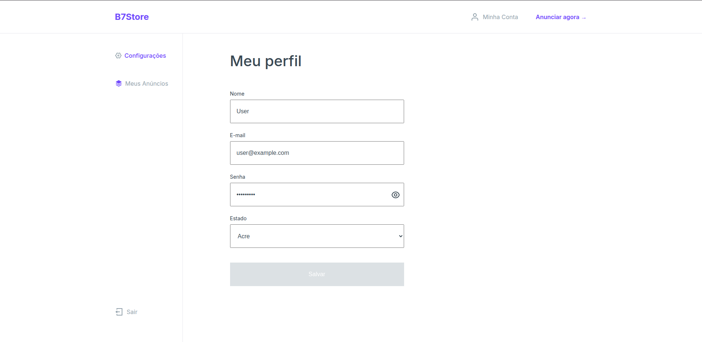
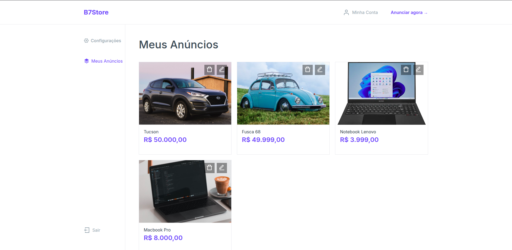

# 🛒 B7Store

B7Store é uma aplicação de e-commerce simples desenvolvida em Laravel, onde usuários podem se cadastrar, criar anúncios de produtos e gerenciar suas publicações. Este projeto foi criado como parte do curso de desenvolvimento web fullstack da [B7Web](https://b7web.com.br), com adições e adaptações feitas por mim para reforçar o aprendizado prático.

---

## ✨ Funcionalidades

-   Cadastro e login de usuários
-   Criação, edição e remoção de anúncios
-   Upload e atualização de imagens dos produtos
-   Definição de título, descrição e preço
-   Contador de visualizações por anúncio
-   Filtro por categorias
-   Sistema de busca por nome
-   Exibição de anúncios relacionados

---

## 🔧 Tecnologias utilizadas

-   **PHP** com **Laravel** (backend e frontend)
-   **MySQL** como banco de dados
-   Templates HTML e CSS fornecidos pelo curso B7Web

---

## 📦 Como rodar o projeto localmente

> Pré-requisitos: PHP, Composer, MySQL e Laravel instalados na máquina.

1. Clone o repositório:

```bash
   git clone https://github.com/seu-usuario/b7store.git
```

2. Acesse o diretório do projeto:

```bash
   cd b7store
```

3. Instale as dependências:

```bash
   composer install
```

4. Copie o arquivo de exemplo .env e configure:

```bash
   cp .env.example .env
```

Edite o .env com as credenciais do seu banco de dados MySQL.

5. Gere a chave da aplicação:

```bash
   php artisan key:generate
```

6. Execute as migrations:

```bash
   php artisan migrate
```

7. Execute os seeders:

```bash
   php artisan db:seed
```

8. Rode o servidor de desenvolvimento:

```bash
   php artisan serve
```

## 📸 Imagens do Projeto








## 🎯 Objetivo do Projeto

Esse projeto foi desenvolvido com fins de estudo, como parte do curso Fullstack da B7Web. Embora a estrutura base tenha vindo dos materiais do curso (HTML/CSS), parte da lógica de funcionamento e foi feita por conta própria para consolidar o conhecimento em Laravel e desenvolvimento web.

## 📌 Licença

Este projeto está sob licença MIT. Sinta-se livre para estudar, modificar e usar como base para aprender mais sobre Laravel.
